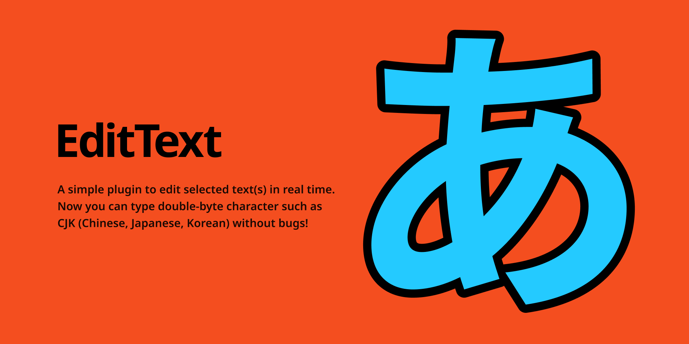

# EditText Figma Plugin

A simple plugin to edit selected text(s) in real time.  
Now you can type double-byte character such as CJK (Chinese, Japanese, Korean) without bugs!

## 🔥 What you can:

- Edit characters of selected text layer in real time
  - Now you can toggle real-time setting
- Edit multiple text layers
- Type double-byte character such as CJK (Chinese, Japanese, Korean) without bugs
- Press 'Esc' or 'Cmd + Enter' to close this plugin

## 📮 Support:

If you have any plobrem or feedback, please use the GitHub Issues.
https://github.com/ryonakae/figma-plugin-edit-text/issues

---

This plugin is made by Ryo Nakae 🙎‍♂️.

- https://brdr.jp
- https://twitter.com/ryo_dg
- https://github.com/ryonakae
